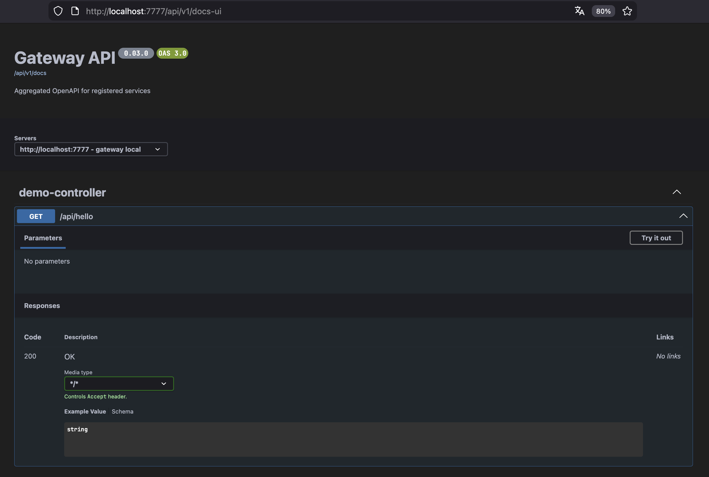
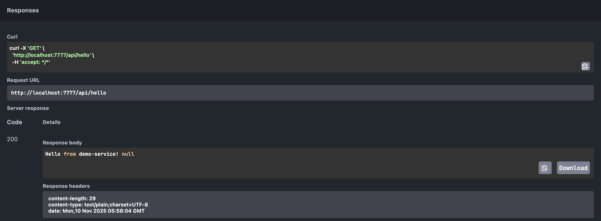

## Gateway API

### Description

**Gateway API** — a Java 21 and Spring Boot 3 (WebFlux) based service for routing requests between microservices, dynamically registering them, and aggregating their OpenAPI documentation.

Key features:

* Dynamic service registration and removal
* Automatic TTL-based service expiration
* Request proxying through registered routes
* Aggregation of multiple OpenAPI specs into a single JSON
* Unified Swagger UI
* Optional access restrictions for documentation

### Service Management

* `POST /internal/service` — register a new service
* `PUT /internal/service/{name}` — update service parameters
* `DELETE /internal/service/{name}` — remove a service
* `GET /internal/service` — list registered services

### Documentation

* `GET /api/v1/docs` — aggregated OpenAPI JSON
* `GET /api/v1/docs-ui` — Swagger UI



### This example shows how a microservice automatically registers itself in the Gateway API to:

- be accessible via dynamic routing,
- provide its OpenAPI documentation,
- and periodically refresh its TTL (time-to-live). 

The Gateway dynamically updates routes and aggregates OpenAPI specs from registered services.

#### Configuration

Example application.yml:

```yaml
server:
  port: 7776

service:
  name: demo-service
  routes: /api/**
  open-api-path: /v3/api-docs

gateway:
  url: http://localhost:7777/internal/service
  ttl-seconds: 30
  heartbeat-ms: 20000
```

Parameters:

- `service.name` — service name (registration identifier).
- `service.routes` — list of route patterns handled by the service.
- `service.open-api-path` — local OpenAPI endpoint (e.g., `/v3/api-docs`).
- `gateway.url` — registration endpoint of the Gateway API.
- `gateway.ttl-seconds` — TTL (time-to-live) in seconds.
- `gateway.heartbeat-ms` — heartbeat interval in milliseconds.

#### 1. Simple REST Controller:

```java
@RestController
public class DemoController {

    @GetMapping("/api/hello")
    public String hello(@RequestHeader(value = "X-User-Id", required = false) String userId) {
        return "Hello from demo-service! " + userId;
    }
}
```

#### 2. Service Registrar:

```java
@Slf4j
@Component
@RequiredArgsConstructor
public class ServiceRegistrar {

    @Value("${gateway.url}")
    private String gatewayUrl;

    @Value("${server.port}")
    private int servicePort;

    @Value("${gateway.ttl-seconds}")
    private int ttlSeconds;

    @Value("${service.name}")
    private String serviceName;

    @Value("${service.routes}")
    private List<String> serviceRoutes;

    @Value("${service.open-api-path}")
    private String openApiPath;

    private final RestTemplate restTemplate = new RestTemplate();
    private ServiceDefinition definition;

    @PostConstruct
    public void register() {
        definition = ServiceDefinition.builder()
                .name(serviceName)
                .routes(serviceRoutes)
                .uri("http://localhost:" + servicePort)
                .openApiUrl("http://localhost:" + servicePort + openApiPath)
                .ttlSeconds(ttlSeconds)
                .build();

        log.info("Registering service {} with gateway {}", definition.getName(), gatewayUrl);
        restTemplate.postForObject(gatewayUrl, definition, Map.class);
    }

    @Scheduled(fixedDelayString = "${gateway.heartbeat-ms}")
    public void heartbeat() {
        if (definition != null) {
            log.info("Sending heartbeat for {}", definition.getName());
            restTemplate.postForObject(gatewayUrl, definition, Map.class);
        }
    }
}
```

#### 3. Model Class:

```java
@Data
@Builder
@NoArgsConstructor
@AllArgsConstructor
public class ServiceDefinition {
    private String name;
    private List<String> routes;
    private String uri;
    private String openApiUrl;
    private int ttlSeconds;
}
```

#### Important: `@EnableScheduling`

To make the `@Scheduled` method (heartbeat) actually run,
you must enable scheduling support in your Spring Boot application.

Add the `@EnableScheduling` annotation to your main class:

```java
@SpringBootApplication
@EnableScheduling
public class ServiceApplication {
    
    public static void main(String[] args) {
        SpringApplication.run(ServiceApplication.class, args);
    }
}
```

Without `@EnableScheduling`, the `heartbeat()` method will never execute,
and the service will stop refreshing its TTL — causing Gateway to remove it after expiration.

#### How It Works

- On startup, ServiceRegistrar sends a POST /internal/service request to the Gateway API.
- The Gateway registers the service and its routes.
- The service periodically sends heartbeat requests to refresh its TTL.
- If the heartbeat stops, the Gateway automatically removes the service after TTL expires.
- The Gateway uses openApiUrl to fetch and aggregate the OpenAPI documentation.

